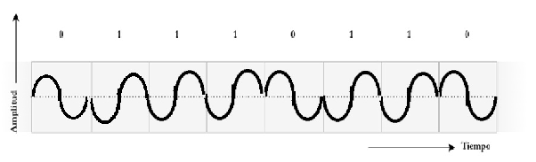
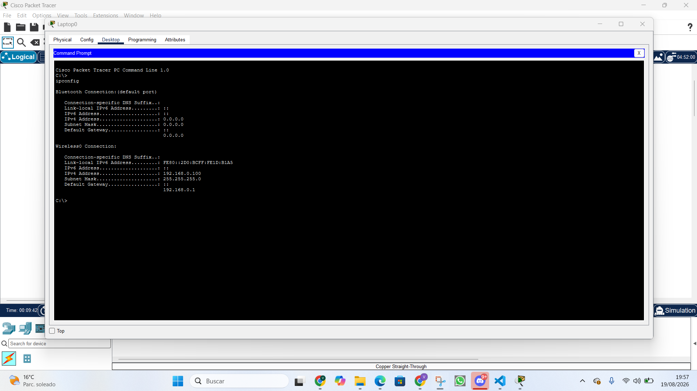
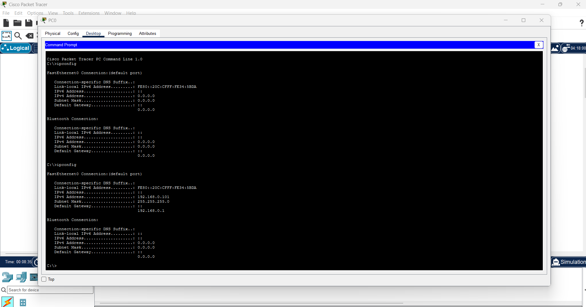
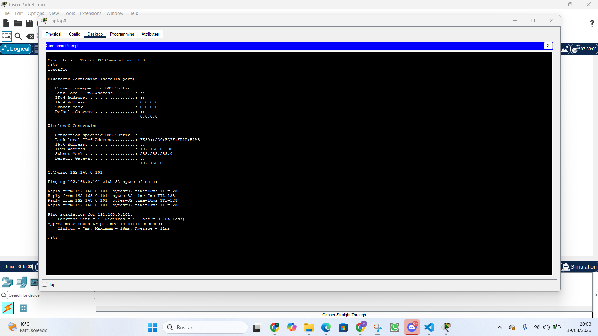
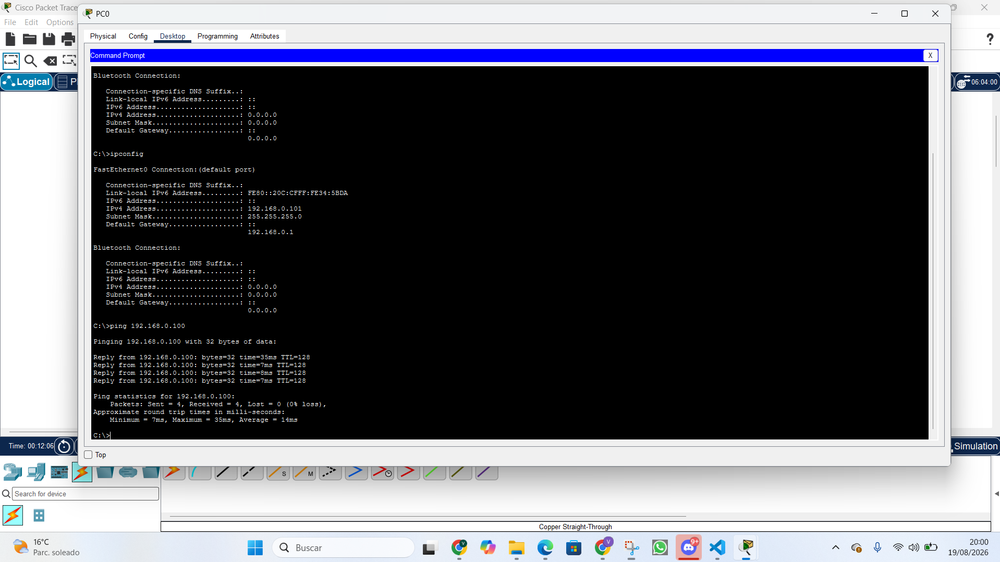
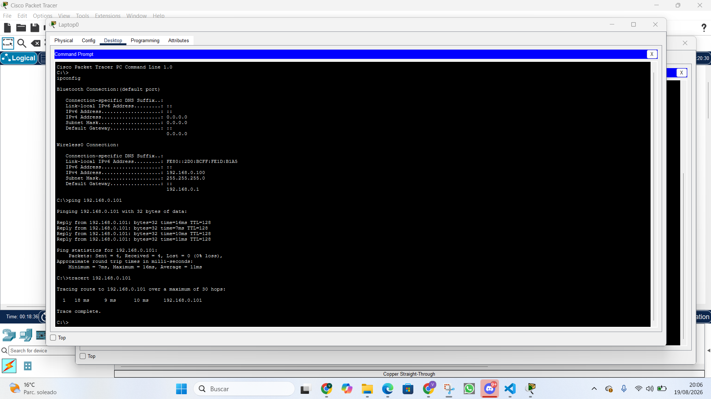
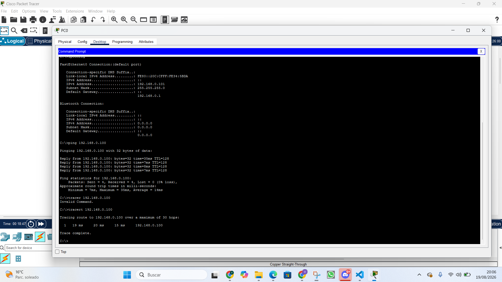
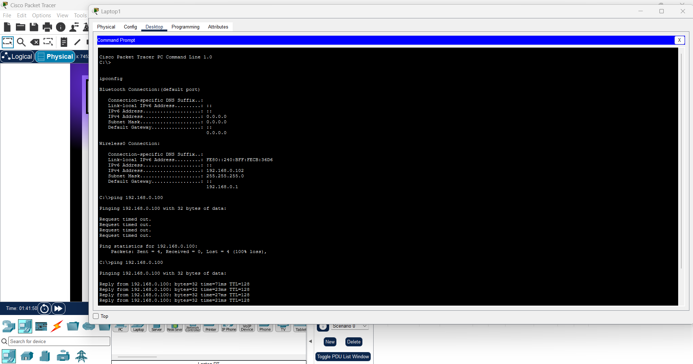

# UNIVERSIDAD NACIONAL DE CÓRDOBA

### FACULTAD DE CIENCIAS EXACTAS, FÍSICAS, Y NATURALES

### CÁTEDRA DE COMPUTACIÓN

## "Trabajo Práctico N°1: Repaso de fundamentos esenciales e introducción a Packet Tracer"

**Alumnos:**

- Angélica Moisés (46765089)
- Victor José Arturo Castro (46522607)
- Genaro Agustín Mateos Ferrero (19103190)
- Eliezer Flores (45172399)
- Tiziano Quevedo (44972730)
- Gonzalo del Cotillo (43216694)
- Mariano Stroppa (46309318)

**Comisión:** ICOMP24-3

---

## Introducción

En este trabajo práctico se revisan conceptos básicos de ondas electromagnéticas, transmisión de datos y técnicas de modulación, para luego aplicarlos en una simulación con Packet Tracer. El objetivo es relacionar la teoría con un caso práctico de conectividad en una red simple, comprobando fenómenos como la atenuación de la señal y la verificación de conectividad entre dispositivos.

---

## Desarrollo

### Punto 1

b)

La longitud de onda ($\lambda$) es la distancia entre dos puntos equivalentes consecutivos de la onda. Entonces:

$ \lambda = 120mm - 60mm = 60 mm = 0,06m$

Si la onda viaja a la velocidad de la luz entonces: $v=c≈3*10^8 \frac{m}{s}$

Teniendo en cuenta que $v=f*\lambda$. Al despejar la frecuencia se tiene:

$f = \frac{v}{\lambda} = \frac{3*10^8 \frac{m}{s}}{0,06m} = 5GHz$

**c)**

- Longitud de onda medida: λ = 60 mm = 0,06 m
- Velocidad de la Luz: c = 3×10⁸ m/s

Con estos datos podemos obtener la frecuencia a través de la siguiente relación:

f = c/λ = 5 GHz

- **Región del espectro:** se ubica dentro de la región perteneciente a las señales microondas, dentro del espectro de radiofrecuencia.
- **Banda según la ITU** (Unión Internacional de Telecomunicaciones): corresponde a la banda SHF (Super High Frequency), que abarca desde 3 GHz hasta 30 GHz.

**d)** Esta banda (5 GHz) es usada en dispositivos de comunicación de datos como: routers que utilizan estándares IEEE 802.11a/n/ac/ax (Wi-Fi 5 y Wi-Fi 6), cámaras e impresoras inalámbricas, enlaces punto a punto, streaming y similares que requieran una velocidad superior a la banda de 2,4 GHz. Un ejemplo sería el router *ASUS ROG Rapture GT-AX11000* o *TP-Link Archer AX73*.

**e)** Dicha línea representa la atenuación, donde la energía de la señal decae con la distancia. Esto ocurre en cualquier medio de transmisión, sea guiado o no guiado.

**f)** Sí, este fenómeno afecta a los routers de internet. Por ejemplo, en la vida cotidiana podemos verlo al alejarnos físicamente del router o si la señal tiene que atravesar paredes gruesas o varios obstáculos: la señal se vuelve inestable. Esto afecta principalmente a las frecuencias más altas, de 5 GHz, que pierden potencia hasta quedar por debajo de la sensibilidad del receptor, forzando la reconexión hacia la banda de 2,4 GHz.

**g)** 
- i) Sí, este fenómeno afecta a las transmisiones de telefonía celular porque la señal pierde potencia por la distancia y por obstáculos físicos (edificios, paredes).

- ii) Sí, este fenómeno afecta a las transmisiones por cable coaxial porque a medida que el cable se hace más largo, la señal eléctrica va perdiendo fuerza por la propia resistencia del material del cable.

- iii) Sí, este fenómeno afecta a las transmisiones por fibra óptica, aunque en una medida mucho menor que en los otros medios.

---

### Punto 2

a)

- El medio de transmision es simplex, pues es unidireccional y el flujo de información tiene un solo sentido.

- La señal es sincrónica porque el emisor comparte un clock con el receptor.

- El modo de transmisión es serie ya que los bits se transmiten secuencialmente a través de un solo canal.

**b)** No, este paradigma no es el mejor para transmitir datos rápida y bidireccionalmente. El paradigma usado en la imagen es simplex, lo que hace imposible que la señal vaya en dos direcciones; debería ser full duplex para ser la mejor forma.

**c)**
Tomando la 4ta letra del nombre de nuestro grupo ("Red Hot **C**hilli Packets" / "Red **H**ot Chilli Packets"), si elegimos la letra **H** (mayúscula), su valor en código ASCII equivale al número decimal 72. En binario de 8 bits se representa como: **`01001000`**.

Para transmitir este byte la señal mantendrá los siguientes niveles de tensión:

* **T0:** Nivel Bajo (`0`)
* **T1:** Nivel Alto (`1`)
* **T2:** Nivel Bajo (`0`)
* **T3:** Nivel Bajo (`0`)
* **T4:** Nivel Alto (`1`)
* **T5:** Nivel Bajo (`0`)
* **T6:** Nivel Bajo (`0`)
* **T7:** Nivel Bajo (`0`)

**d)** Considerando la pendiente mencionada y graficada, pensamos que lo más adecuado sería medir el nivel de tensión en cada flanco de bajada de la señal de clock, donde ya se estabilizó la señal. En el gráfico esto será T0, T2, T4 y consecutivamente todos los TX pares.

---

### Punto 3

Razones por las que no conviene transmitir una señal escalonada de forma inalámbrica:

1. **Ancho de banda excesivo:** una señal digital formada por pulsos cuadrados contiene componentes de muchas frecuencias debido a sus cambios abruptos. Entonces, al transmitirla sin modular, ocupa un ancho de banda considerable e interfiere con canales vecinos.
2. **Limitación física de las antenas:** para que una antena pueda transmitir bien una señal, sus dimensiones deben estar relacionadas con la longitud de onda de la misma. Esta depende de la frecuencia de la señal, y como una señal digital incluye componentes de muy baja frecuencia, sería necesario construir antenas de tamaños absurdamente grandes. A esto se suma que las antenas funcionan mejor en bandas angostas, lo contrario al ancho de banda de una señal cuadrada.
3. **Deformación por el canal y aparición de Interferencia Intersimbólica (ISI):** el canal inalámbrico no responde igual en todo el rango de frecuencias. Cada componente espectral sufre distinta atenuación y distinto retardo, deformando los flancos y generando interferencia entre símbolos consecutivos.

**a)** Se trata de la técnica llamada **BPSK** (Binary Phase Shift Keying / Modulación por Desplazamiento de Fase Binaria).

**Justificación:**

- Tanto la amplitud como la frecuencia de la portadora permanecen sin cambios durante todos los intervalos de bit.
- La información binaria queda codificada en la fase de la portadora, cambiando cada 180 grados. Es decir: Bit 0 con fase inicial de 0 grados (comienza con semiciclo positivo); Bit 1 con desfase de 180 grados (comienza con semiciclo negativo).

**b)**

**c)** Si hablamos de modulaciones de señales analógicas para datos digitales, otras técnicas similares son la FSK, ASK, QAM y todas sus variantes, dependiendo de la cantidad de símbolos distintos que se quieran transmitir.

**d)** El BER es un parámetro que indica qué tan bueno es el desempeño de un sistema de comunicación determinado. Fundamentalmente, indica la probabilidad de error por bit determinado. La técnica de modulación con mejores prestaciones es la PSK; la comparación entre las técnicas y sus eficiencias se encuentra desarrollada en el libro.

---

### Punto 4

## Conclusiones

Comparando los tiempos de viaje de los paquetes para el caso de la laptop dentro de la oficina y la notebook fuera de ella, podemos observar que su valor aumenta notoriamente, lo que resulta en una conexión "lenta". Por otro lado, si nos alejamos demasiado del router, como en el caso de la 2da prueba del punto 4h, ya no tenemos recepción de los paquetes debido a que estamos fuera del rango de la red que genera el router. Esto nos permite comprobar, por medio de una simulación, el fenómeno que contamos en el punto 1 sobre la atenuación de la señal a medida que nos alejamos del origen de la misma.
