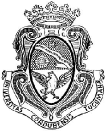
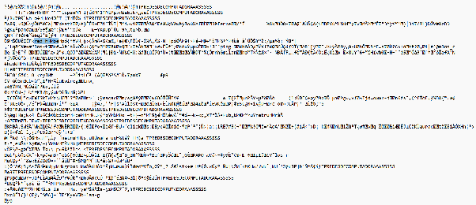
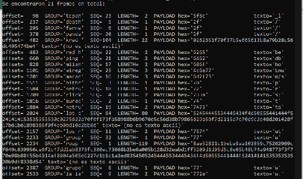

# Trabajo Práctico N°2: Conceptos fundamentales de capa física y capa de enlace de datos

  

**Universidad Nacional de Córdoba**
**Facultad de Ciencias Exactas, Físicas y Naturales**
**Cátedra de Computación**

**Alumnos:**
- Angélica Moisés (46765089)
- Victor José Arturo Castro (46522607)
- Genaro Agustín Mateos Ferrero (19103190)
- Eliezer Flores (45172399)
- Tiziano Quevedo (44972730)
- Gonzalo del Cotillo (43216694)
- Mariano Stroppa (46309318)

**Comisión:** ICOMP24-3

---

## Punto 1

1. En la figura se observa el efecto Doppler. Este aparece cuando hay un movimiento relativo entre el emisor y el receptor. Debido a dicho movimiento, cambia la longitud de onda observada.

   Teniendo en cuenta la relación fundamental entre frecuencia y longitud $f = \frac{v}{\lambda}$ se puede deducir que:
   - Si la fuente de la señal se acerca al receptor, la longitud de onda disminuye y la frecuencia percibida aumenta.
   - Si la fuente se aleja del receptor, la longitud de onda aumenta y la frecuencia percibida disminuye.

   En la figura el barco se desplaza hacia el satélite, por lo que la longitud de onda $\lambda$ disminuye y en consecuencia hay un aumento en la frecuencia. Por lo que la frecuencia recibida es mayor a la emitida.

2. El efecto Doppler afecta a las transmisiones de tipo no guiadas donde existe algún movimiento relativo entre emisor y receptor. A su vez, se puede decir que son más susceptibles al efecto las transmisiones de bandas altas, ya que el efecto de desplazamiento Doppler es directamente proporcional a la frecuencia de la portadora:

   $$f_D = \frac{v}{\lambda}\cos(\theta) \quad \text{con} \quad \lambda = \frac{c}{f_C} \quad \Rightarrow \quad f_D = \frac{v f_C}{c}\cos(\theta)$$

   Podemos ver que también hay una proporcionalidad directa con la velocidad relativa entre emisor y receptor. Entonces, bajo el mismo razonamiento, vemos que el efecto será mayor en sistemas de alta movilidad.

3. Los celulares operan con modulaciones de frecuencia de ondas electromagnéticas que pueden interferir en los sistemas de comunicaciones de los aviones. Por ello se prohíbe su uso para llamadas principalmente en los momentos cruciales de despegue y aterrizaje, aunque los aviones modernos pueden estar certificados para tolerarlos. Por otro lado, estos dispositivos podrían interferir con las condiciones de operación de redes terrestres, y en esto se relaciona el efecto Doppler: la velocidad relativa entre el teléfono y las antenas dificulta la comunicación con la red celular.

## Punto 2

1. El fenómeno físico representado es la interferencia de ondas o ruido. Este se caracteriza por darse cuando dos o más ondas coinciden en el mismo punto al mismo tiempo; estas terminan sumándose, alterando la onda original, amplificándola o atenuándola.

2. Este fenómeno afecta principalmente a las transmisiones que se producen en las bandas de radio y de microondas del espectro electromagnético. Las transmisiones ópticas, correspondientes a las regiones de infrarrojo y visible —como es el caso de la fibra óptica—, son las más resistentes a los efectos del ruido.

3. La SNR es la *Signal to Noise Ratio* (Relación Señal-Ruido), que describe qué tan fuerte es la señal con respecto al ruido. El BER (*Bit Error Rate*) es la proporción de bits incorrectos recibidos respecto al total transmitido. Ambos conceptos están muy relacionados, dado que una mayor SNR significará un menor BER, ya que el receptor podrá diferenciar con mayor facilidad la señal del ruido. De manera análoga, una SNR pobre implicará un mayor BER por el mismo motivo.

## Punto 3

**Detección y Corrección de Errores**

1. Los sistemas de transmisión digital enfrentan el ruido del canal calculando un código de redundancia a partir de los bits que se van a enviar (por ejemplo, un bit de paridad o un CRC) y adjuntándolo a los datos. El receptor repite ese mismo cálculo sobre los bits que efectivamente recibió y compara el resultado con el código recibido: si no coinciden, sabe que hubo un error en el canal. Esto es detección: permite saber que algo salió mal, pero no necesariamente dónde ni cómo arreglarlo, por lo que suele combinarse con retransmisión (ARQ).

2. La corrección de errores utiliza más bits de redundancia (códigos como Hamming, o en general FEC); el receptor no solo detecta que hubo un error, sino que puede identificar qué bit(s) fallaron y corregirlos sin pedir retransmisión. Esto es especialmente útil en enlaces donde retransmitir es costoso o lento (satélite, radio), y es una de las tres estrategias generales (junto con ARQ y HARQ).

**Compensación de cambios en la frecuencia**

Como la atenuación y el retardo de un canal varían con la frecuencia, distintas componentes de frecuencia del espectro de la señal llegan más débiles o desfasadas que otras, distorsionando la señal recibida (distorsión de atenuación y distorsión de retardo). Por ello los sistemas usan ecualizadores —bobinas de carga en líneas telefónicas, o filtros/algoritmos de procesamiento digital en sistemas más modernos— para "aplanar" esa respuesta en frecuencia y compensar el efecto. En entornos móviles/inalámbricos, donde el canal cambia todo el tiempo, se usa ecualización adaptativa, que ajusta sus parámetros dinámicamente para reagrupar la energía de los símbolos dispersada por el desvanecimiento selectivo en frecuencia.

## Punto 4

1. La sincronización en comunicaciones digitales es la coordinación temporal entre emisor y receptor para determinar correctamente los instantes de muestreo de la señal. La sincronización de bits trabaja en la capa física, identificando el inicio y fin de cada bit individual para interpretarlo como un 0 o un 1. En cambio, la sincronización de trama actúa en la capa de enlace, determinando los límites (inicio y fin) de un bloque completo de datos para poder separar los campos de control de la carga útil.

2. Una trama (*frame*) es el bloque o unidad de datos estructurada en la capa de enlace para transportar información a través del medio. El encabezado (*header*) se ubica al principio y contiene información de control como direcciones de origen/destino y tipo de protocolo. La carga útil (*payload*) es el cuerpo central de la trama, donde viaja el paquete de datos real proveniente de la capa superior. Por último, el tráiler (*trailer*) se coloca al final y lleva campos de verificación (como el CRC) para detectar errores ocurridos durante la transmisión.

3. Las funciones principales de un preámbulo son:
   1. Le da al receptor un patrón conocido para sincronizar su reloj con el del emisor antes de que lleguen los datos reales. Ejemplo: en Ethernet, el preámbulo son 7 octetos de bits 1 y 0 alternados que el receptor usa justamente para establecer la sincronización.
   2. La delimitación: marca dónde empieza (y a veces también dónde termina) la trama, permitiendo al receptor distinguir el "silencio" o ruido de línea de una trama real.

   Con respecto a si el preámbulo forma parte de la carga útil (*payload*), la respuesta es no. El preámbulo no forma parte de la carga útil que se quiere transmitir; es overhead de control, igual que el resto del header/trailer.

4. Métodos para delimitar tramas:
   1. **Longitud fija**: todas las tramas tienen exactamente la misma cantidad de bytes. El receptor solo cuenta esa cantidad fija para saber dónde termina una y empieza la siguiente. Ej: celdas ATM.
   2. **Campo indicador de longitud**: la cabecera incluye un campo numérico con el tamaño exacto en bytes de la trama. El receptor lee el valor y cuenta esos bytes para ubicar el final. Ej: campo *Length* en Ethernet.
   3. **Secuencias delimitadoras**: se usan secuencias específicas de bits o caracteres al inicio y al final de la trama. Para evitar que la secuencia aparezca dentro de los datos y corte la trama antes de tiempo, se insertan bits o bytes de escape. Ej: protocolos HDLC.

## Punto 5

**a)**

Utilizando un programa en Python podemos encontrar los posibles payloads de distintos grupos, tomando en cuenta los HDR de las cinco letras en minúsculas.

Luego, nuestro frame es el del grupo "red h":

- **GROUP:** red h
- **SEQ:** 22
- **LENGTH:** 2
- **PAYLOAD:** be (62=b, 65=e en ASCII)

**b)** Utilizando el SEQ para concatenar los caracteres (y completando algunos espacios vacíos), conseguimos el siguiente link: [https://www.youtube.com/shorts/dbbe_ln6Lnw](https://www.youtube.com/shorts/dbbe_ln6Lnw)

## Bibliografía

1. Sevlian, Raffi, Chun, Carl, Tan, Ian, Bahai, Ahmad, Laberteaux, Ken, *Channel Characterization for 700 MHz DSRC Vehicular Communication*, Journal of Electrical and Computer Engineering, 2010.
2. Jean Walrand, Pravin Varaiya, University of California, Berkeley, *High-Performance Communication Networks (Second Edition), Chapter 7 - Wireless Networks*, 2000.
3. United States Department of Transportation, *Use of Portable Electronic Devices Aboard Aircraft*, 2017.
4. Stallings, W. *Comunicaciones y Redes de Computadores*, 7ª edición.
