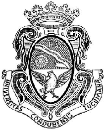

UNIVERSIDAD NACIONAL DE CÓRDOBA

FACULTAD DE CIENCIAS EXACTAS, FÍSICAS, Y NATURALES

CÁTEDRA DE COMPUTACIÓN 

**“**Trabajo Práctico N°2: Conceptos fundamentales de capa física y capa de enlace de datos”

Alumnos:  
Genaro Agustín Mateos Ferrero (19103190)  
Angélica Moisés (46765089)  
Victor José Arturo Castro (46522607)  
Eliezer Flores (45172399)  
Tiziano Quevedo (44972730)  
Gonzalo del Cotillo (43216694)  
Mariano Stroppa (46309318)

Comisión: ICOMP24-3 
