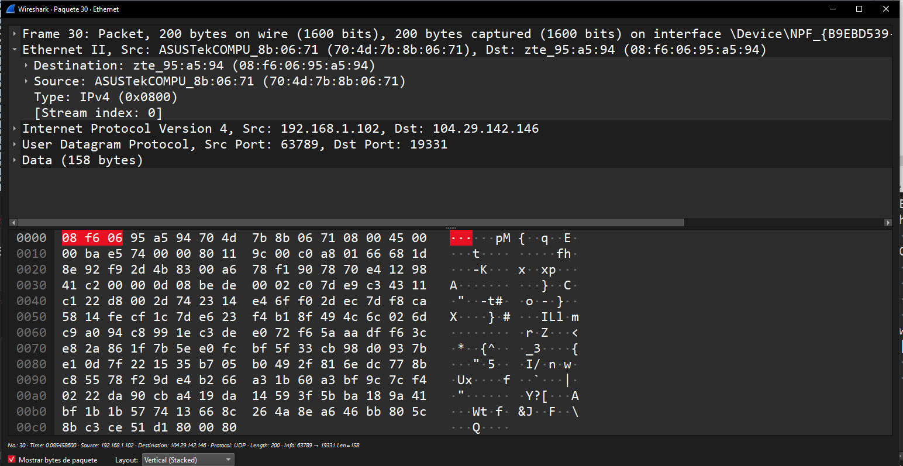
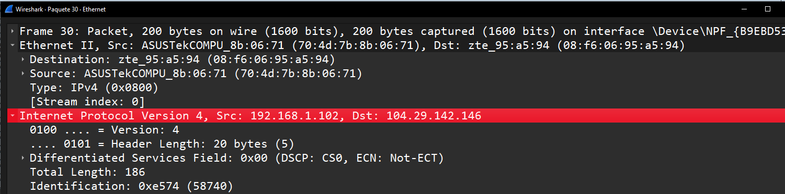
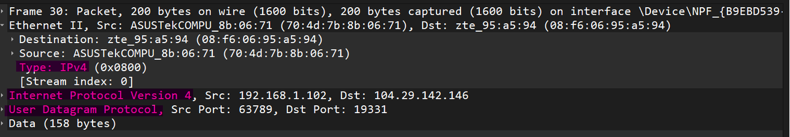
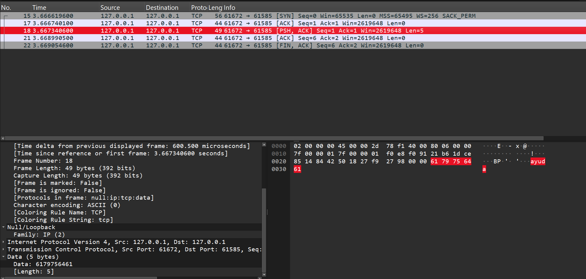
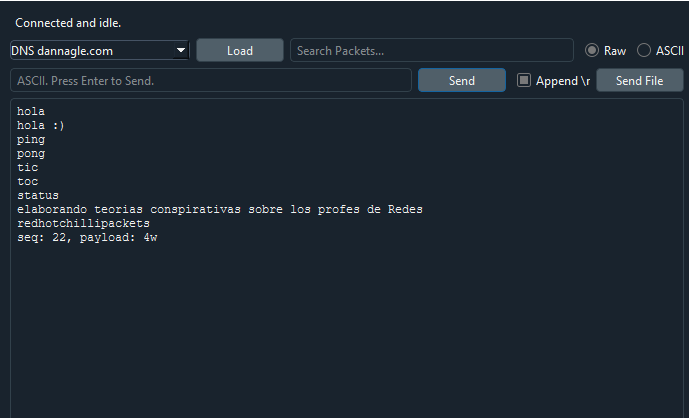
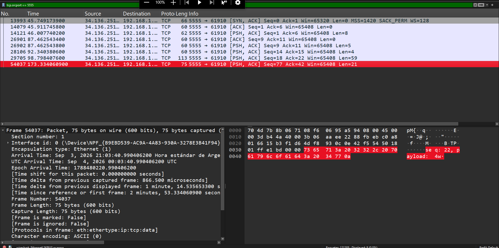

UNIVERSIDAD NACIONAL DE CÓRDOBA

FACULTAD DE CIENCIAS EXACTAS, FÍSICAS, Y NATURALES

CÁTEDRA DE COMPUTACIÓN 

**“**Trabajo Práctico N°2: Conceptos fundamentales de capa física y capa de enlace de datos”

Alumnos:  
Genaro Agustín Mateos Ferrero (19103190)  
Angélica Moisés (46765089)  
Victor José Arturo Castro (46522607)  
Eliezer Flores (45172399)  
Tiziano Quevedo (44972730)  
Gonzalo del Cotillo (43216694)  
Mariano Stroppa (46309318)

Comisión: ICOMP24-3 

## Punto 1:

Vamos a empezar observando cómo se organiza la información dentro de una red local:

a) ¿Qué función cumple la capa de enlace dentro del modelo OSI? ¿Qué tipo de comunicación resuelve?

La capa de enlace de datos en el modelo OSI se encarga de transformar el medio de transmisión físico en un enlace fiable y libre de errores para la capa de red, gestionando la estructuración de datos en tramas, el direccionamiento físico (direcciones MAC), la detección de errores y el control de flujo. Con esto, resuelve la comunicación nodo a nodo o salto a salto, garantizando la transferencia directa y correcta de tramas de datos exclusivamente entre dos dispositivos adyacentes conectados en el mismo segmento de red local.

b) ¿Qué es una dirección MAC? ¿En qué se diferencia de una dirección IP?

Una dirección MAC es un identificador físico, único e inalterable grabado en la tarjeta de red del hardware para identificar a un dispositivo a nivel local. Se diferencia de una dirección IP en que esta última es una dirección lógica y jerárquica asignada por software que puede cambiar según la ubicación de la red, sirviendo para el encaminamiento global de datos a través de distintas subredes; mientras que la dirección MAC solo actúa en la capa de enlace para la comunicación directa entre dispositivos adyacentes dentro de la misma red local.

c) ¿Qué es una trama Ethernet? Identificar sus principales campos y explicar brevemente para qué sirve cada uno.

Una trama Ethernet es la unidad de información digital utilizada en redes LAN para transmitir datos a través de un medio físico compartido. Su función es encapsular los datos procedentes de las capas superiores agregando información de control tanto al principio como al final para gestionar de forma segura el direccionamiento, la sincronización y la detección de errores.
Principales campos:
Preámbulo: consiste en un patrón de bits ceros y unos alternados que el receptor utiliza para establecer y asegurar la sincronización de reloj con el emisor.
SFD: contiene la secuencia de bits específica 10101011. Su función es avisar al receptor del comienzo real de la trama, permitiendo localizar con precisión el primer bit de los campos siguientes.
DA: identifica la estación física o estaciones a las que va dirigida la trama. Puede ser una dirección de receptor único, de un grupo o una dirección global.
SA: identifica de manera unívoca la dirección física de la estación emisora que genero y transmitió la trama
Longitud: tiene doble función dependiendo de la especificación, En la norma IEEE 802.3 representa la longitud del campo de datos en octetos, mientras que en la especificación primitiva de Ethernet representa el tipo de protocolo transportado.
Datos: container la unidad de datos de protocolo proporcionado por la capa de LLC.
Relleno: consiste en octetos adicionales agregados únicamente cuando el mensaje es muy corto, para garantizar que la trama alcance una longitud mínima.
FCS: contiene un código de comprobación de redundancia cíclica de 32 bits calculado sobre todos los campos de la trama (excepto el preámbulo, SFD y FCS). Sirve para que el receptor detecte si la trama sufrió alteraciones o errores durante su tránsito por el canal.

d) ¿Qué información permite determinar qué protocolo de capa superior está transportando una trama Ethernet?

El mecanismo para determinar el protocolo de capa superior depende de la especificación con la que trabaje la red. En la especificación primitiva de Ethernet se determina de forma directa mediante el campo Longitud/Tipo. Este valor indica directamente a que protocolo de capa superior se le deben entregar los datos en el destino. En el estándar de la norma IEEE 802.3, como se utiliza para especificar la longitud de los datos, la determinación del protocolo se desplaza al campo de datos de la trama, donde la misma encapsula una cabecera de la capa LLC y dentro de ella los campos DSAP y SSAP contienen las direcciones de punto de acceso al servicio que identifican de manera específica qué protocolo de capas superior es el origen y el destino de la información.

## Punto 2:

Usando Wireshark, capturar tráfico generado por su propia computadora mientras acceden a una página web o ejecutan alguna aplicación que utilice la red (en general no hace falta hacer nada realmente, el tráfico normal de la computadora ya genera UNA BOCHA de paquetes a internet).

a) Seleccionar una trama Ethernet e identificar las direcciones MAC de origen y destino. ¿A qué dispositivos creen que corresponden?   

* MAC origen: `70:4d:7b:8b:06:71` → ASUSTek Computer (la laptop desde la que se capturó el tráfico).   
* MAC destino: `08:f6:06:95:a5:94` → ZTE Corporation (el router de la red local), este es el salto desde donde salimos para internet. 

b) Dentro de la misma trama, identificar el paquete IP. ¿Cuáles son las direcciones IP de origen y destino? (no importa si son versión 4 o versión 6\)   
  
Dentro de esta trama podemos observar que el paquete es IPv4 (Type: 0x0800 en la capa Ethernet, y se confirma en la cabecera IP con "Versión: 4") 

* IP origen: `192.168.1.102` (dirección privada, la PC local).   
* IP destino: `104.29.142.146` (dirección pública, servidor en Internet). 

c) Comparar las direcciones MAC y las direcciones IP encontradas. ¿Representan lo mismo?

No representan lo mismo, la dirección IP representa ubicaciones de red, mientras que MAC  lo hace respecto a la dirección física del hardware. Dicho de otro modo, la dirección IP identifica la conexión del dispositivo en la red, y la MAC el dispositivo en sí. Además se puede observar que los primeros 6 dígitos de ésta última representan al fabricante del dispositivo (OUI, Organizational Unique Identifier), por esto vemos ASUSTekCOMPU en source y zte_95 en destination.

d) Observar el campo EtherType. ¿Qué protocolo está encapsulado dentro de la trama analizada?
 
Observamos que el protocolo encapsulado en la trama analizada es el llamado “protocolo de datagrama de usuario” (User Datagram Protocol), que pertenece dentro de la familia TCP/IP y, en este caso, utiliza Internet Protocol versión 4.

## Punto 3:

Vamos ahora a subir una capa y observar el transporte de información mediante TCP.

a) ¿Qué problema(s) resuelve TCP que no resuelve directamente Ethernet ni IP?

Los problemas que resuelve TCP que los otros no pueden resolver serían: la entrega fiable de datos entre aplicaciones, ya que da retransmite paquetes si nota ausencia de alguno; el control de flujo de datos y el ordenamiento de datos por si estos llegan desordenados al entrar por distintos medios.

b) Investigar los campos más importantes de la metadata en un frame TCP. ¿Para qué sirve cada uno?

Los campos de un segmento TCP y sus usos son:

- **Puerto de origen (16 bits):** Indica el número de puerto del emisor.
- **Puerto de destino (16 bits):** Indica el número de puerto del receptor.
- **Número de secuencia (32 bits):** Especifica el número de secuencia del primer byte de datos de este segmento.
- **Número de reconocimiento (32 bits):** Identifica la posición del byte más alto recibido.
- **Desplazamiento de datos (4 bits):** Especifica el desplazamiento de la parte de datos del segmento (longitud del encabezado).
- **Flags:** Bits de control para identificar la finalidad del segmento:
  - **URG:** El campo de puntero urgente es válido.
  - **ACK:** El campo de reconocimiento es válido.
  - **PSH:** El segmento solicita un PUSH (procesamiento inmediato).
  - **RST:** Restablece la conexión.
  - **SYN:** Sincroniza los números de secuencia.
  - **FIN:** El remitente ha alcanzado el final de la corriente de bytes.
- **Ventana (16 bits):** Especifica la cantidad de datos que el destino está dispuesto a aceptar.
- **Checksum (16 bits):** Verifica la integridad de la cabecera y los datos del segmento.
- **Puntero urgente (16 bits):** Indica datos que se deben entregar lo más rápidamente posible. Especifica la posición donde finalizan los datos urgentes.

c) Explicar el Three y Four way handshake en TCP.

El Three way handshake o diálogo en tres pasos, como su nombre indica, consiste básicamente de tres partes. En la primera el emisor o cliente inicia el proceso de comunicación enviando un segmento TCP con la flag de SYN activada y un número de secuencia inicial  i. Luego el receptor o servidor confirma el número de secuencia recibido enviando un AN=i+1 y envía su propio número de secuencia inicial j.(SYN + ACK). Finalmente, el cliente confirma el número de secuencia del servidor enviando AN=j+1 y se establece la conexión.
El Four way handshake funciona de forma similar:
Paso 1: el usuario emite una orden de cierre (Close) y se envía  un segmento con el bit de FIN activado (FIN i).
Paso 2: el receptor recibe el FIN y devuelve una confirmación ACK con AN= i+1.
Paso 3: cuando el receptor termina de enviar todos sus datos pendientes y su usuario ejecuta la orden de cierre, envía su propio segmento FIN  j.
Paso 4: el emisor inicial confirma el FIN enviando un ACK AN = j+1 , luego debe esperar un intervalo de tiempo igual a dos veces el máximo tiempo de vida esperado un segmento antes de cerrar definitivamente la conexión.

d) Iniciar la conexión enviando un paquete, capturar el handshake y el paquete de datos. Analizar el paquete de datos, sus distintas partes y encontrar la carga útil del paquete usando WireShark.

e) Finalizar la conexión y capturar el Four-way handshake.

-

f) ¿Qué conclusión podemos sacar de que sea tan fácil ver un paquete que viaja a través de la red?

Que sea tan fácil ver los datos demuestra que la red, por sí sola, no oculta ni protege la información que enviamos. Sin protección, una persona conectada a la misma red puede interceptar e interpretar los mensajes enviados. El sistema básico de internet solo se encarga de que los datos lleguen a destino, no de guardarlos en secreto. Todo lo dicho anteriormente demuestra que es necesario utilizar ciertos protocolos para proteger la información.

## Punto 4:

Siguiendo los pasos para iniciar la conexión pudimos verificar las respuestas del servidor con los comandos correspondientes.

Después de conseguir el paquete específico para nuestro grupo, pudimos completar el siguiente link utilizando los comandos de los demás grupos: https://www.youtube.com/watch?v=dQw4w9WgXcQ
