UNIVERSIDAD NACIONAL DE CÓRDOBA

FACULTAD DE CIENCIAS EXACTAS, FÍSICAS, Y NATURALES

CÁTEDRA DE COMPUTACIÓN 

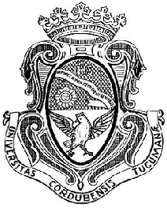

**“Trabajo Práctico N°4: Capas de Acceso en Redes Locales, Protocolos y Fundamentos”**

Alumnos:  
Genaro Agustín Mateos Ferrero (19103190)  
Angélica Moisés (46765089)  
Victor José Arturo Castro (46522607)  
Eliezer Flores (45172399)  
Tiziano Quevedo (44972730)  
Gonzalo del Cotillo (43216694)  
Mariano Stroppa (46309318)

Comisión: ICOMP24-3 

## Punto 1:

## Punto 2:

En el presente informe se omiten los comandos correspondientes a los incisos a al f, dado que ya se encuentran detallados en el enunciado del trabajo práctico. Tras configurar los switches con sus respectivos hostname, credenciales de acceso y la asignación de VLANs según la tabla de ruteo, verificamos la conectividad de extremo a extremo entre los hosts mediante el comando "ping".  Se muestra el resultado en las capturas de pantalla:

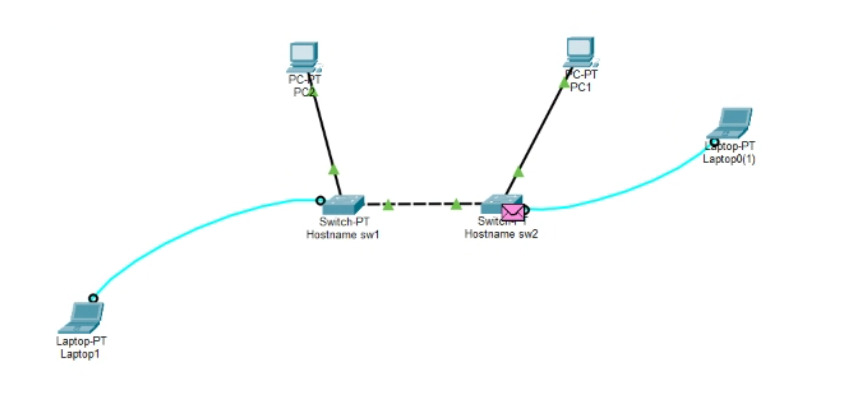

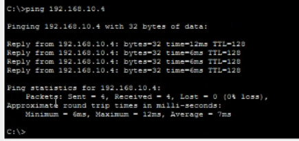

Luego creamos las VLAN especificadas en el punto h) y verificamos su correcto funcionamiento con el comando "show vlan brief". Observamos que la VLAN por defecto es la VLAN 1:

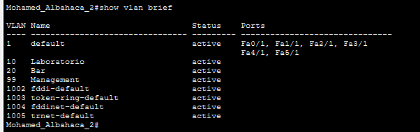

A continuación, la interfaz FastEthernet 2/1 (correspondiente a la PC-A) se asignó a la VLAN 10 (Laboratorio). Posteriormente, se procedió a migrar la interfaz de administración: se removió la dirección IP de la interfaz virtual por defecto (VLAN 1) y se configuró en la interfaz virtual de la VLAN 99 (Management). Este procedimiento permite aislar lógicamente la administración del equipo del tráfico de los usuarios. Se visualizan los cambios en la captura:

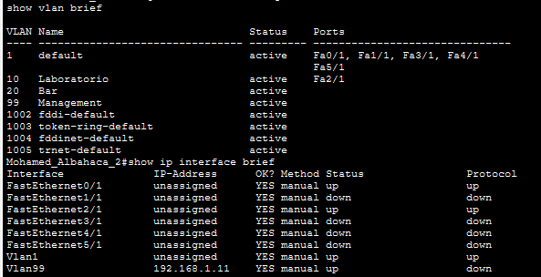

Repetimos los mismos cambios en el switch 2:

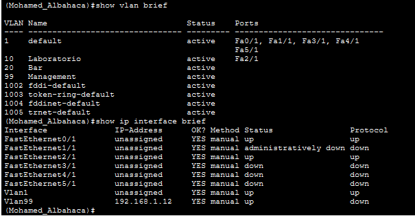

Al finalizar estas configuraciones, verificamos que no hay conectividad entre las PCs ni entre los Switches, debido a la separación entre VLANs. Aunque la PC-A y la PC-B pertenecenn a la VLAN 10 (Laboratorio), se encuentran en switches distintos cuyo enlace de interconexión opera, por defecto, en la VLAN 1. Para que los paquetes alcancen su destino, es indispensable configurar este enlace en modo troncal (trunk), lo que permitirá etiquetar y transportar el tráfico de múltiples VLANs a través de la misma conexión física.

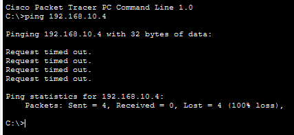

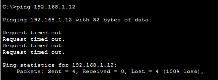

## Punto 3:

El objetivo es separar el tráfico de red de los pasajeros y de la tripulación utilizando VLANs (Redes Virtuales). Esto divide la infraestructura compartida en redes lógicas independientes, permitiendo aplicar distintas reglas de acceso según requiera la aerolínea.

La topología incluye:

- Un servidor local para el sistema de entretenimiento.

- Un switch de acceso que conecta los dispositivos finales a su VLAN correspondiente.

- Un router principal (Gateway) que dirige el tráfico interno y aplica las políticas de seguridad.

- Un router externo que provee la salida a Internet.

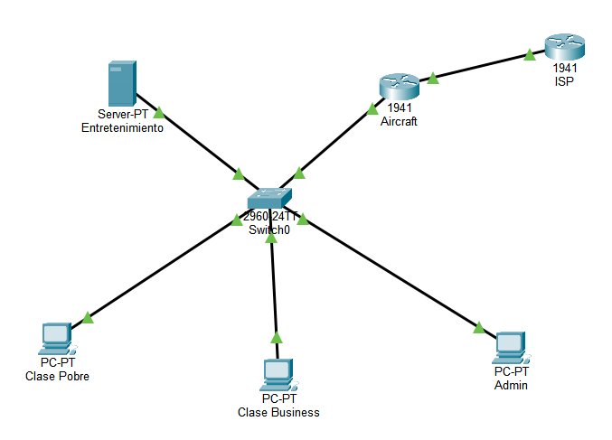

#### Pruebas

- Validación Clase Turista (VLAN 10)

El dispositivo final de la clase Turista es capaz de hacer ping y resolver las peticiones HTTP hacia el servidor de entretenimiento. 

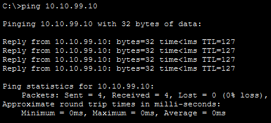

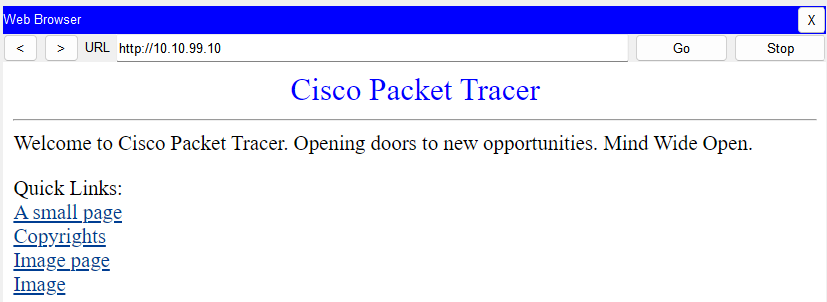

Sin embargo, al intentar enviar una solicitud de ping hacia un servidor externo (8.8.8.8) no hay éxito.

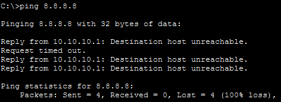

- Validación Clase Business (VLAN 20)

Desde la PC Business se accede correctamente al servidor de entretenimiento (`http://10.10.99.10`).

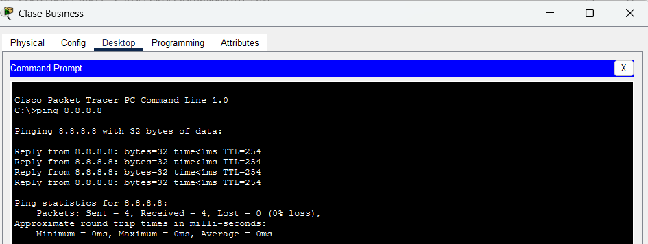

El ping a 8.8.8.8 es exitoso: el router Aircraft aplica NAT con sobrecarga (PAT) y traduce las direcciones de la VLAN 20 a la IP pública `200.0.0.1`.

- Validación Admin(VLAN 99)

La PC Admin tiene conectividad con Turista, Business, el servidor e Internet (acceso total).

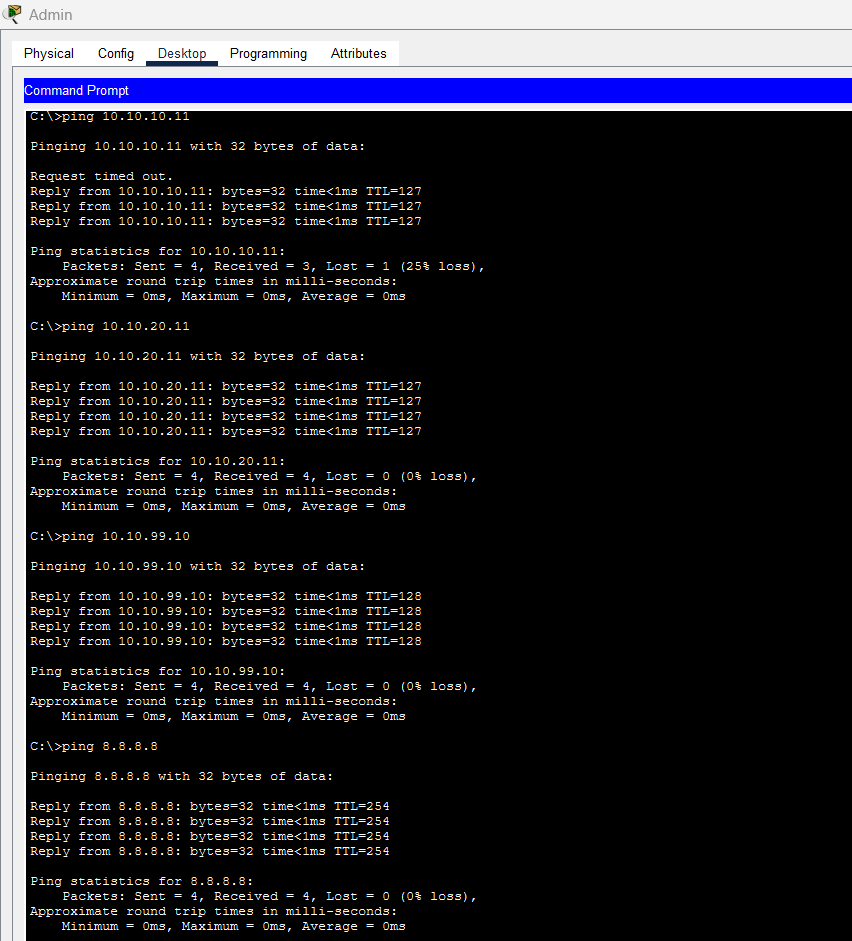

#### Conclusión

#### Conclusión

En este trabajo se realizo la red de un avión donde todos comparten los mismos equipos, pero no todos pueden acceder a las mismas funciones. Usamos VLANs para separar a los pasajeros en tres grupos: Turista, Business y Admin, como si cada grupo tuviera su propia red.

Después controlamos qué puede hacer cada uno. Turista solo puede entrar al servidor de entretenimiento, porque una ACL (una lista de reglas) le bloquea el acceso a Internet. Business puede usar el servidor e Internet, y Admin puede acceder a todo. Para que Business y Admin salgan a Internet usamos NAT, que hace que todos los dispositivos salgan con una única dirección pública.

En sintesis las pruebas salieron como se esperaba: cada grupo puede acceder a lo que le corresponde y nada más.