UNIVERSIDAD NACIONAL DE CÓRDOBA

FACULTAD DE CIENCIAS EXACTAS, FÍSICAS, Y NATURALES

CÁTEDRA DE COMPUTACIÓN 

**“Trabajo Práctico N°5: Transmisión de Datos”**

Alumnos:  
Genaro Agustín Mateos Ferrero (19103190)  
Angélica Moisés (46765089)  
Victor José Arturo Castro (46522607)  
Eliezer Flores (45172399)  
Tiziano Quevedo (44972730)  
Gonzalo del Cotillo (43216694)  
Mariano Stroppa (46309318)

Comisión: ICOMP24-3 

## Punto 1:

Investigar brevemente y documentar:

a) La ICMP es el protocolo de mensajes de control de Internet (Internet Control Message Protocol). Se utiliza para enviar diagnósticos, mensajes de control y notificaciones de errores entre dispositivos de red.
No transporta datos de aplicaciones de usuario, sino que sirve exclusivamente para la gestion y diagnostico de la red.

b) El estándar IP especifica que una implementación que cumpla las especificaciones del protocolo debe también implementar ICMP. ICMP esta al mismo nivel que IP en el conjunto de protocolos TCP/IP, pero es en la practica , un usuario de IP, dado que cuando se construye un mensaje de ICMP se pasa por IP para que sea encapsulado y luego transmitido de la forma habitual. El receptor sabe que se trata de un mensaje ICMP porque el campo Protocolo de la cabecera IP indica que el contenido encapsulado corresponde a ICMP

c) Ping genera tráfico mediante el envío de mensajes ICMP Echo Request y la recepción de mensajes ICMP Echo Reply. Echo Request es un paquete que sale desde el emisor para verificar que el receptor esta escuchando. Echo Reply es un mensaje que envia el receptor para confirmar que recibio el mensaje. El campo de ICMP que permite distinguir entre un Echo Request y unEcho Reply es el campo de Tipo

d) Un mensaje ICMP de tipo Echo contiene como mínimo 1 byte de Tipo, 1 byte de Código, 2 bytes de Suma de Comprobación (Checksum), 2 bytes de Identificador y 2 bytes de número de secuencia.

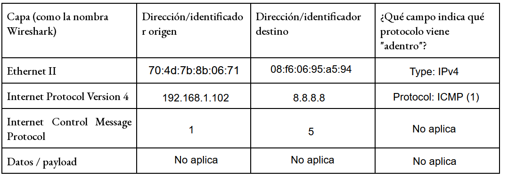

a) La MAC destino de la 8.8.8.8 no es la MAC de 8.8.8.8, la MAC que vemos pertenece al router zte.
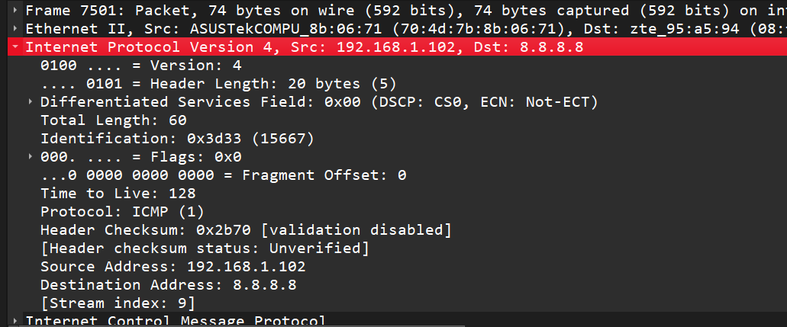
Comparandola con la MAC del ping que hicimos al gateway podemos apreciar que resultan que son la misma, ambas pertenecientes al router zte. 
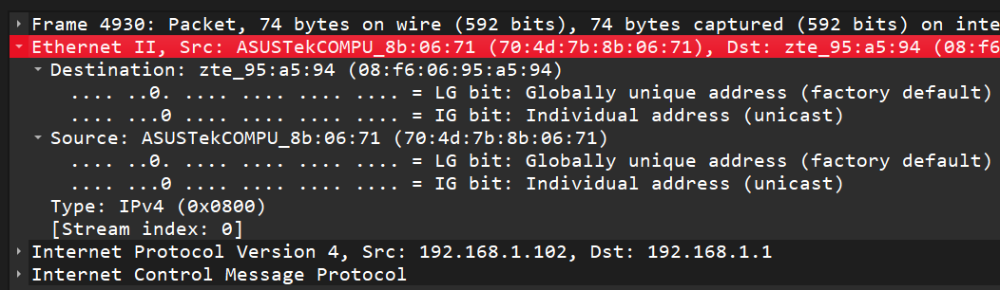
La conclusion a la que llegamos es que la direccion MAC se manejan unicamente de forma interna dentro de una LAN para identificar dospositivos y no se puede usar para enviar a un dispositivo fuera de la LAN, para esto se usa la ip que tiene un alcance más grande.

b) 

- Ethernet II: Se invierten las direcciones MAC de origen y destino. No cambia el campo *Type*.

- IPv4: Se invierten las direcciones IP de origen y destino. Cambian el *TTL* y el *Header Checksum*. Se mantienen *Version*, *Header Length* y *Protocol*.

- ICMP: Cambia el campo *Type*, 8 en el Echo Request y 0 en el Reply. Tambien cambia  *Checksum*. No cambian el *Identifier*, el *Sequence Number* y la carga útil (*Payload*).

Razon de los cambios:

- Direcciones (MAC e IP): Su inversión refleja el cambio de roles la comunicación; el destinatario ahora asume el rol de emisor para enviar la respuesta.

- TTL y Checksums: TTL difiere porque el paquete de respuesta es instanciado por el servidor remoto y sufre un decremento de saltos en el camino de regreso. Las modificaciones en estos parámetros obligan a recalcular los checksums de IP e ICMP.

- Type de ICMP: Para que se reconozca el datagrama como una respuesta a su consulta previa.

Identificador y Número de Secuencia:

Ambos campos se devuelven intactos para que el protocolo ICMP pueda realizar el seguimiento y la multiplexación sobre IP. El *Identifier* vincula la respuesta entrante con el proceso exacto del sistema operativo que originó la solicitud. El *Sequence Number* asocia cada respuesta con su paquete de envío individual, lo que permite al sistema emparejarlos unívocamente para calcular el tiempo de ida y vuelta (RTT) o detectar pérdida de datagramas.

c) El payload del ping queda dentro de la parte ICMP (Internet Control Message Protocol) en la sección de "Data". 

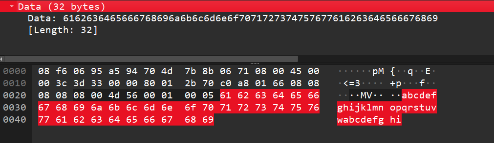

Tiene 32 bytes que contienen el mensaje que se quería transmitir, en este caso es el abecedario llegando hasta la letra "w" y volviendo a comenzar para llegar hasta la letra "i". Al compararlos, vemos que este contenido es igual en el mensaje de reply. 

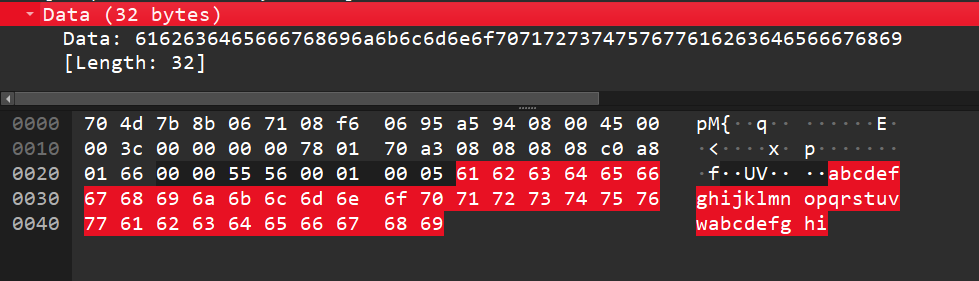

No contamos con ninguna computadora que tenga Linux, pero al investigar aprendimos que el payload podría tener datos distintos ya que es el sistema operativo quien decide qué datos van en el mensaje de ping.

d) El valor del TTL Echo Request enviado es de 128, mientras que el TTL Echo Reply recibido desde 8.8.8.8 es de 120. (Se puede observar en las capturas del punto B)
No son iguales porque la función del router sobre el TTL hace que cada vez que un paquete IP atraviesa un router, el mismo decrementa el valor del campo TTL en 1. Su objetivo es evitar que un paquete circule indefinidamente por la red en caso de que ocurra un bucle de enrutamiento.

e) En whireshark pudimos ver el tamaño de cada encabezado:

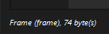

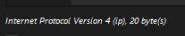

Entonces el dibujo como "cajas dentro de cajas" queda:

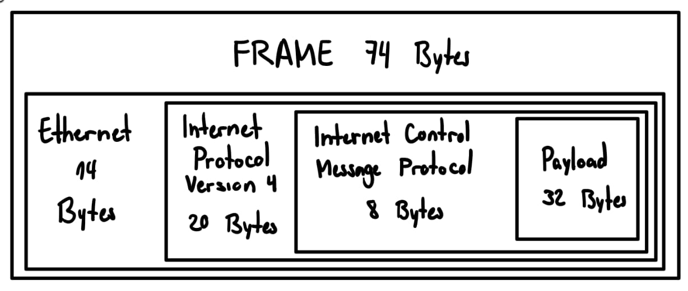

## Punto 2:

Investigar brevemente:

a) ARP resuelve el problema de obtener la dirección de MAC de un dispositivo a partir de su dirección de IP, lo cual es esencial para la comunicacion entre dispositivos dentro de una misma red de area local . Lo ubicaria en la capa 2, correspondiente al enlace de datos. Aunque es debatible dado que mapea direcciones correspondientes a la capa 3 de direcciones logicas, con direcciones fisicas de la capa 2.

b) ARP Request es un mensaje de difusión que se envía a toda la red con el objetivo de identificar la dirección de MAC asociada a una dirección IP dada. Una ARP Reply es el proceso inverso, cuando el dispositivo identifica que la IP consultada le pertenece, este responde únicamente al emisor indicándole su dirección MAC.

c) El cache ARP es una tabla guardada temporalmente en la memoria RAM del sistema operativo que relaciona las direcciones IP de la red local con sus correspondientes direcciones MAC físicas. La misma existe para optimizar el tráfico de red y evita enviar una solicitud ARP Request por broadcast cada vez que la computadora quiere mandar un paquete a un equipo local con el que ya se comunicó recientemente.

d) Pendiente de completar

e) Observamos desde la caché ARP que la dirección MAC asociada al gateway es 08-f6-06-95-a5-94. 

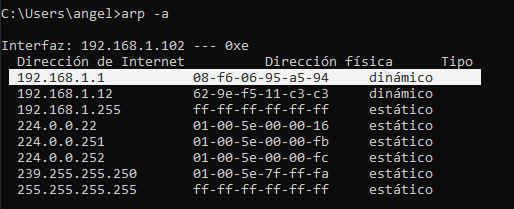

Esto coincide con la dirección MAC destino que vimos en el punto 1. Vemos Dst: zte_95:a5:94 donde zte es el prefijo que corresponde a los primeros 6 octetos de la dirección: 08-f6-06. 

f) Analizando un ARP Request y su correspondiente ARP Reply, completamos la tabla:

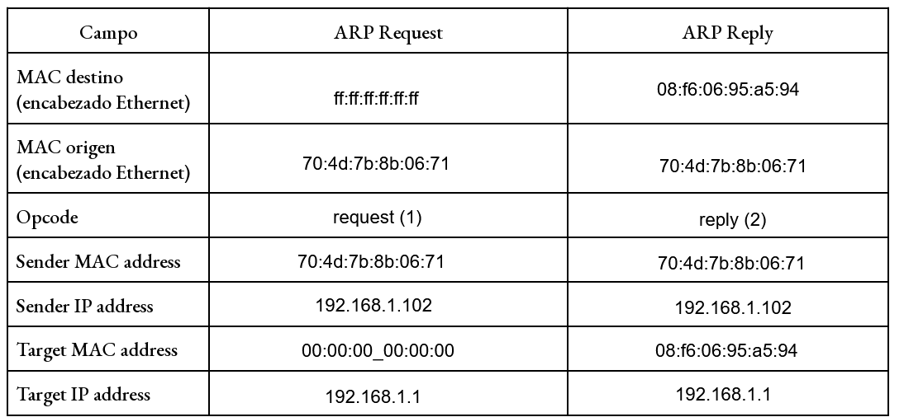

a) 

El emisor no conoce la dirección MAC del destinatario, solo su IP, por lo que se ve obligado a enviar la consulta a todos los hosts de la subred local simultáneamente, preguntando a qué nodo le pertenece dicha IP. 

La respuesta transmite de manera directa al solicitante. El dispositivo de destino extrae la dirección MAC del emisor desde el encabezado del paquete entrante. Al conocer la MAC de quien realizó la consulta, el host puede responderle de forma exclusiva.

*Target MAC address* tiene el valor `00:00:00:00:00:00`. Dicho campo debe alojar la dirección física del objetivo; sin embargo, como esa información es la que el protocolo busca obtener, el sistema operativo inicializa el campo vacío a la espera de que el dispositivo de destino lo complete con su verdadera MAC al construir el mensaje de respuesta.

b) El valor que observamos que tiene le campo type del ARP en el encabezado ethernet es de 0x0806. No hay un encabezado IP luego del Ethernet unicamente hay encabezado ARP. ARP vive en la capa la capa 2, se encapsula directamente en la trama de ethernet, sin llegar ha tener encabezado IP.
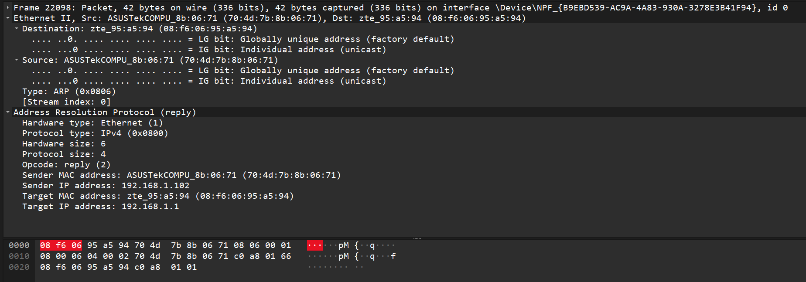

c) Aparecieron 4 paquetes de solicitud ARP Request

No hubo ningun ARP Reply ni tampoco se registro ningun paquete ICMP Echo Request

La ausencia de ARP Reply se debe a que la direccion de IP no esta asignada a ningun equipo activo en la red local, entonces al emitir la solicitud mediante un mensaje a la direccion de difusion, ningun dispositivo reconoce la IP como propia, por lo que nadie responde.
No se encontro ningun paquete ICMP Echo Request porque para que la computadora pueda transmitir el paquete IP que transporta la solicitud ICMP (capa 3), esta debe encapsularse dentro de una trama de la capa 2 ethernet y para eso debemos conocer la direccion MAC fisica del destino. Como la resolucion de la IP mediante protocolo ARP no obtuvo respuesta, el pila de red del S.O cancela la operacion y nunca llega a tansmitir el paquete a la red.

d) En la repetición aparecieron ARP en whireshark, sin embargo vemos que no son de nuestra PC hacia el gateway, sino que el router envió su propio request hacia la computadora ("Who has 192.168.1.102? Tell 192.168.1.1"). 

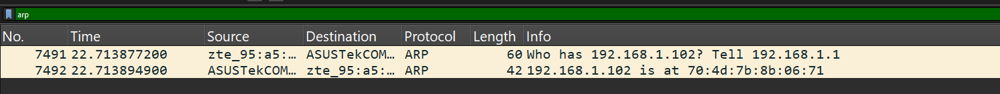

La falta del request de nuestra computadora al gateway se debe a que quedó guardado en la caché ARP por el ping anterior:

Entonces la ventaja del caché es que evita enviar un broadcast para comunicarnos con un destino ya conocido. Es bajo la misma lógica que surge el problema: al quedar una entrada vieja, incluso si hay cambios, no se va a hacer un broadcast sino que será utiizada la misma entrada. Los paquetes se enviarán a una dirección incorrecta hasta que la entrada vieja sea actualizada. 

## Punto 3:

Investigar brevemente:

a) Pendiente de completar

b) Pendiente de completar

c) Pendiente de completar

#### 2. Sección Experimental

 **a) ¿Qué pasó en la red cuando ejecutaron el comando del cliente, antes de escribir el primer mensaje? Compárenlo con TCP.**

* En TCP (`ncat -v 127.0.0.1 12000`): Al ejecutar el comando en el cliente, la red generó inmediatamente 3 paquetes correspondientes al inicio de conexión (*Three-Way Handshake*: `SYN` $\rightarrow$ `SYN-ACK` $\rightarrow$ `ACK`), estableciendo el canal antes de que el usuario escriba algun mensaje.
* En UDP (`ncat -v -u 127.0.0.1 12001`): No se generó ningún paquete en la red. UDP es un protocolo no orientado a conexión y no realiza ninguna preparación previa.

> **Imagen asociada:** `Todos_los_paquetes_TCP.png` (Muestra los primeros paquetes con banderas `[SYN]`, `[SYN, ACK]` y `[ACK]`).
> 
> 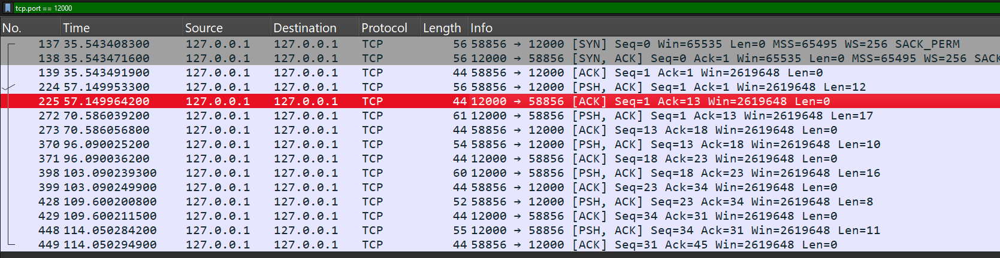

 **b) ¿Cuántos datagramas generó cada mensaje? ¿Hay algo parecido a un ACK?**

* Cantidad: Cada línea de texto enviada desde la terminal en UDP generó exactamente 1 datagrama independiente en la red.
* Confirmación: No hay nada parecido a un ACK. UDP no verifica si el paquete llegó a su destino ni solicita confirmaciones de recepción.

> **Imágenes asociadas:** 
> 
> * `Conversacion_Dos_Terminales_UDP.png` (Muestra el intercambio de mensajes entre terminales).
> * `UDP_Mensaje_Largo.png` (Muestra cómo cada mensaje produce un único registro/datagrama en Wireshark sin paquetes de confirmación intercalados).
> 
> 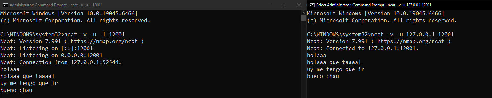
> 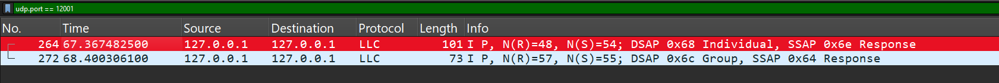

---

 **c) Comparen el encabezado UDP con el encabezado TCP de un segmento con datos: ¿qué campos tiene cada uno? ¿Cuántos bytes ocupa cada encabezado?**

* Encabezado UDP: Ocupa 8 bytes fijamente y consta de solo 4 campos (de 2 bytes cada uno):
  
  1. *Source Port* (Puerto origen)
  2. *Destination Port* (Puerto destino)
  3. *Length* (Longitud del datagrama)
  4. *Checksum* (Suma de comprobación)

* Encabezado TCP: Ocupa 20 bytes (tamaño mínimo sin opciones) e incluye campos orientados al control y la confiabilidad:
  
  1. *Source Port* y *Destination Port*
  2. *Sequence Number* y *Acknowledgment Number* (para ordenamiento y confirmaciones)
  3. *Header Length*, *Flags* (`SYN`, `ACK`, `PSH`, `FIN`, `RST`), *Window Size* (control de flujo)
  4. *Checksum* y *Urgent Pointer*.

> **Imágenes asociadas:**
> 
> * `Paquete_UDP.png` (Detalle del encabezado UDP de 8 bytes).
> * `Paquetes_TCP_2.png` (Detalle del encabezado TCP de 20 bytes con sus banderas y ventanas).
> 
> 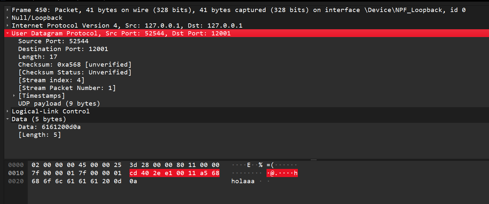
> 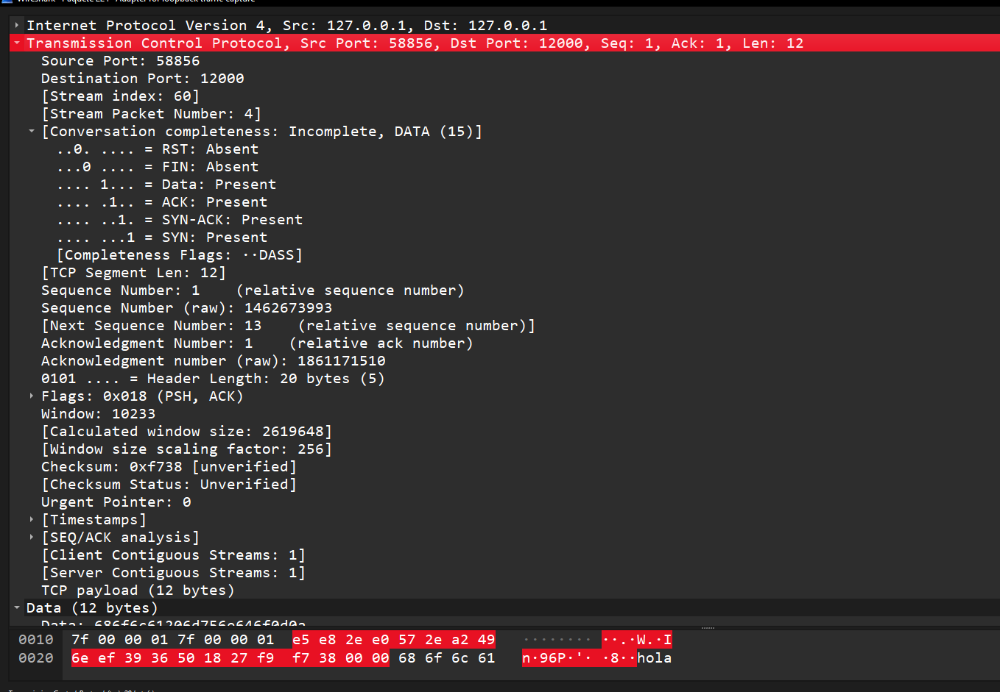

---

 **d) ¿Qué pasó en la red al cerrar el cliente con Ctrl+C? ¿Y en TCP?**

* En UDP: Al presionar `Ctrl+C`, el proceso del cliente se cerró localmente sin generar ningún paquete en la red.
* En TCP: Al cerrar el cliente se generó el proceso de cierre ordenado (*Four-Way Wavehandshake* o envío de bandera `RST`/`FIN` con sus correspondientes `ACK`), informando a la otra parte que la sesión finalizó.

> **Imagen asociada**: `Mensaje_Cerrando_TCP.png` (Muestra el detalle del paquete de control con banderas de cierre/reseteo `RST, ACK`).
> 
> 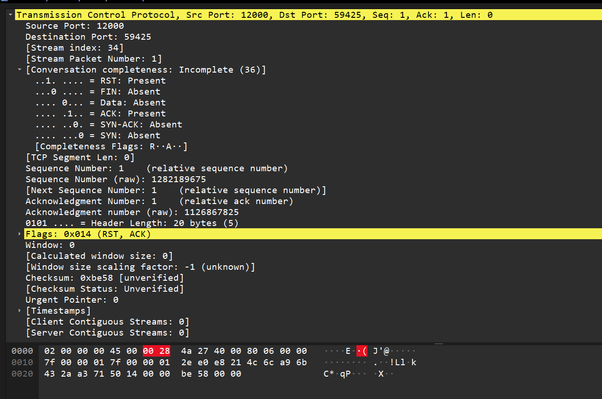

e) 

- **UDP:** 1 paquete para enviar la frase.

- **TCP:** 9 paquetes.        
  - 3 paquetes para el establecimiento de conexión (*Three-Way Handshake*: `SYN`, `SYN-ACK`, `ACK`).
  -  2 paquetes para la transmisión del mensaje (1 segmento `PSH, ACK` con la frase y 1 `ACK` de confirmación del receptor).
  - 4 paquetes para el cierre elegante de la conexión (`FIN, ACK`, `ACK`, `FIN, ACK`, `ACK`).

Los paquetes adicionales de TCP permiten transformar un canal no confiable (IP) en una comunicación transparente y confiable. Se obtiene:

- **Confiabilidad y retransmisión:** Garantía de entrega mediante mensajes de confirmación (`ACK`) y retransmisión automática si un paquete se pierde.

- **Entrega ordenada.** 

- **Control de flujo y congestión:** Evita saturar la memoria del receptor o congestionar los routers intermedios de la red.

- **Cierre elegante y sincronización:** Asegura la negociación de parámetros de sesión al inicio y confirma que no queden datos pendientes en los búferes antes de liberar los sockets.

**f) ¿Y si nadie escucha? Con Wireshark capturando en loopback y el filtro tcp.port == 12000 || udp.port == 12001 || icmp, sin servidores corriendo**

En TCP la conexión falla de inmediato, y sale un mensaje en la terminal:

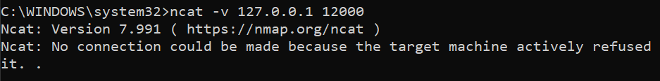

Luego en wireshark observamos que se intenta comenzar el three way handshake con un segmento SYN. Como ningún proceso escucha en ese puerto, el sistema operativo responde con un segmento RST, ACK. Esto se repite varias veces de forma automática intentando establecer conexión.

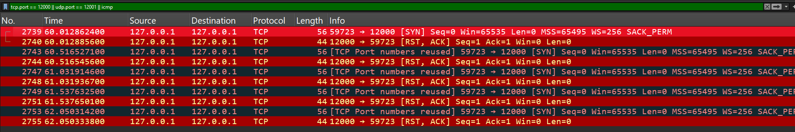

En UDP, como no hay un handshake, no se garantiza la conexión. Se puede enviar un datagrama sin saber si alguien lo recibe:

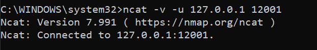

En wireshark podemos ver el datagrama que se envió al puerto 12001. No obtuvimos ninguna respuesta o mensaje de error. En teoría esperaríamos un mensaje ICMP Destination Unreachable (Port Unreachable) pero tampoco es garantizado.

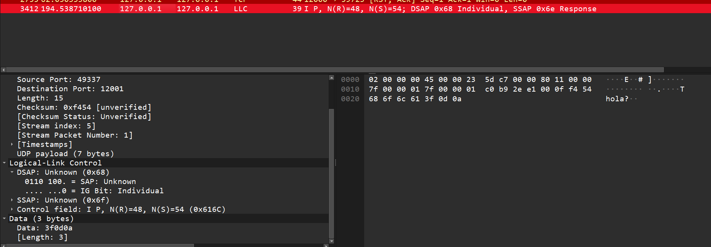

## Punto 4:

a) -

b) -

c) -

d) 

| **Llamada**     | **¿Dónde se ejecuta?** | **¿Genera tráfico?** | **Segmentos que observan (Número y Flags)**                       |
| --------------- | ---------------------- | -------------------- | ----------------------------------------------------------------- |
| **`socket()`**  | servidor y cliente     | No                   | Ninguno.                                                          |
| **`bind()`**    | servidor               | No                   | Ninguno.                                                          |
| **`listen()`**  | servidor               | No                   | Ninguno.                                                          |
| **`connect()`** | cliente                | Sí                   | 387: `[SYN]`, 388:`[SYN, ACK]`, 389:`[ACK]`                       |
| **`accept()`**  | servidor               | No                   | Ninguno.                                                          |
| **`sendall()`** | servidor               | Sí                   | 392: `[PSH, ACK]`, 393: `[ACK]`                                   |
| **`recv()`**    | servidor               | No                   | Ninguno.                                                          |
| **`close()`**   | ambos                  | Sí                   | 394: `[FIN, ACK]` , 395: `[ACK]`, 396: `[FIN, ACK]`, 397: `[ACK]` |
